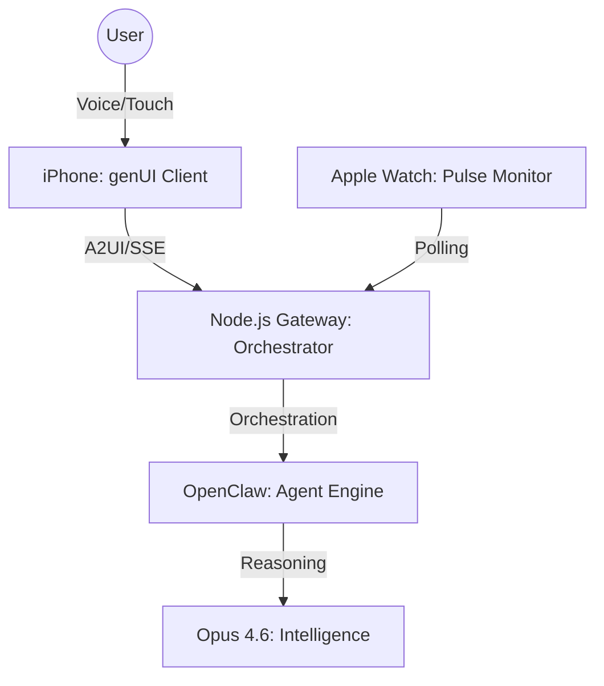

# clawfree Architecture

## System Overview
**clawfree** is a hands-free AI agent orchestrator powered by Flutter genUI, built with the **A2UI v0.9** protocol. It separates high-fidelity visual interaction from agent orchestration.

## 1. The Thin Client (iPhone/Watch)
*   **Tech Stack**: Flutter 3.38.9 + `genui` v0.9 runtime.
*   **Responsibilities**:
    *   **Perception**: Hardware-level STT (Voice Input) and TTS (Voice Output).
    *   **Rendering**: Real-time assembly of the **Aero-HUD** (Glassmorphism, `technicalGlow`, and `SpringCurve` animations).
    *   **Haptics**: Tactile feedback mapped to A2UI interaction results.
    *   **Continuity**: Mirroring active session states between iPhone and Apple Watch.

## 2. The Cloud Orchestrator (clawfree Gateway)
*   **Tech Stack**: Node.js + Express + Server-Sent Events (SSE).
*   **Why it exists (Server-side necessity)**:
    *   **CORS & SSE Proxy**: Manages streaming connections between Opus 4.6 and mobile clients.
    *   **A2UI Translation**: Wraps raw Agent responses into visual Surface schemas.
    *   **Session Management**: The "Source of Truth" that enables Watch/Phone synchronization.
    *   **Security**: Centralized vault for API keys (Anthropic/OpenAI) to prevent client-side exposure.

## 3. The Engine (OpenClaw)
*   **Tech Stack**: Docker + Node.js CLI.
*   **Responsibilities**:
    *   **Agent Lifecycle**: Creating, starting, and monitoring isolated agent environments.
    *   **Tool Execution**: Running system shell commands, GitHub integrations, and file I/O.
    *   **Sandboxing**: Ensuring agent activities are isolated from the host OS.

## 4. The Intelligence (Anthropic Opus 4.6)
*   **Pattern**: "Prompt-First" genUI.
*   **Role**: A single streaming call generates both the conversational text and the A2UI JSON required to render the management surfaces (The Hangar, The Fabricator, Travel Concierge).

## 5. A2UI Component Catalog (35 Components)

The catalog extends genUI's core ~19 components with clawfree-themed additions and overrides:

**Custom components** (12): ResponsiveContainer, HealthSparkline, VideoPlayer, TripMap, Gap (with named sizes), BrandLogo, Badge, ProgressBar, Chip, Grid, Stack, Animated

**Core overrides** (4 — same name replaces genUI defaults):
- **Card** — glass/flat/outlined/elevated variants with glassmorphism
- **Button** — primary/secondary/ghost/danger/borderless with pill shape, icon support
- **Text** — standard variants (h1-h5, caption, body) + technical/mono/label/overline with JetBrainsMono
- **ChoicePicker** — iOS-style segmented control (mutuallyExclusive) + FilterChips (multipleSelection)

All registered in `lib/src/core/catalog.dart` via `CoreCatalogItems.asCatalog().copyWith([...])`.

## Data Flow: "The Voice Loop"
1.  **Input**: User speaks to iPhone; `speech_to_text` converts to string.
2.  **Request**: iPhone sends text + Device Context to **Gateway**.
3.  **Inference**: Gateway builds system prompt (including A2UI catalog) and calls **Opus 4.6**.
4.  **Stream**: Opus streams text (Voice) and JSON (UI). Gateway proxies this via SSE.
5.  **Render**: iPhone renders the Surface (e.g., a Travel Itinerary) using **Staggered Entrance** animations.
6.  **Confirm**: `EarconService` plays a synthesized chime; `flutter_tts` reads the AI response.
